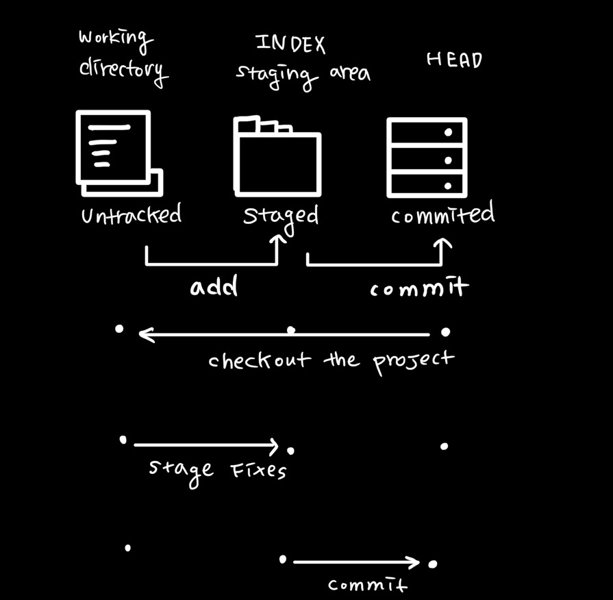
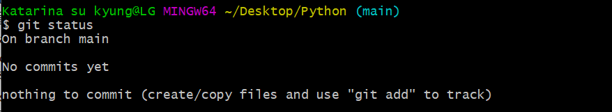
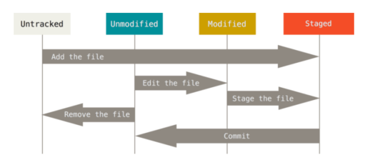
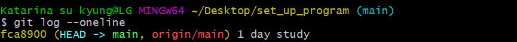

# 😎 GIT_버전기록하기  

#### 📂 Section 4. 기본 흐름 파악하기!

◾ **working directory (= working tree)**

> **내가 작업 또는 수정한 파일** / **작업을 하는 프로젝트 디렉토리 **

◾ **staging area (= index)** => **임시공간!!**

> **git add를 한 파일들이 존재하는 영역**
>
> **커밋을 하게 되면 staging area에 있는 파일들만 커밋에 반영됨**
>
> **세밀한 버전 관리를 위해 staging area는 꼭 필요하다** 
>
>  **(파일을 수정을 했더라도 다음 커밋에 반영하고 싶지 않을 수도 있기 때문)**

**◾ respository** **(HEAD)**

> **working directory의 변경 이력들이 저장되어 있는 영역**
>
> **커밋을 하면 staging area에 있던 파일들의 모습이 비디오의 한장면 처럼 스냅샷(snapshot)🎞처럼 repository에 저장됨**
>
> **COMMIT이 된 상태** 

---

**✅ [staging area 가 왜 필요할까요?](https://centbin-dev.tistory.com/entry/Github-git%EC%9D%98-3%EA%B0%80%EC%A7%80-%EC%98%81%EC%97%AD%EA%B3%BC-%EB%9D%BC%EC%9D%B4%ED%94%84-%EC%82%AC%EC%9D%B4%ED%81%B4?category=1088035) ** 

staging area에 대해 정의에도 나와 있듯이 파일을 수정했더라도 다음 커밋에 반영하고 싶지 않을 수도 있기 때문입니다. 그래도 git directory에 바로 올리면 더 편리하지 않을까? 라는 생각을 할 수 있습니다. 

staging area의 필요성에 대해 더 알아보고자합니다. 

1) 일부분만 commit 할 때 

   : 여러 코드 작업을 진행 후 commit 하기 전에 일부분만 하고 싶을 대 staging area까지만 올려놓습니다. 

2) 충돌 해결할 때 

   : 많은 충돌이 발생하고 충돌이 발생하지 않는 코드가 섞여 있다면 해결하는 과정이 복잡해 질 수 있습니다. 

   staging area에서 충돌을 해결하면 충돌이 발생하지 않은 코드는 바로 commit 이 가능합니다. 

   그리고 조금씩 코드를 수정하면 먼저 commit 하여 빠르게 소스 코드를 올려 공유가 가능합니다. 

3)  commit 다시 하기 

   commit --amend 명령으로 commit을 다시 할 때 staging area를 활용한다. 

   commit -amned 명령을 하기 전 추가로 commit 에 소스 코드를 포함하려면 git .add 를 하면 됩니다. 

#### 📂 Section 5. 버전 기록 하기 

`git add [file]`

`git add .`

여기서 점은 현재 프로젝트 디렉토리 내에서 변경사항이 생긴 모든 파일들을 staging area에 추가하라 라는 뜻 

`git commit -m 'commit message'`

버전으로 모은다 commit                                                                                                                                                                                                                                                                                                                                                                                                                                                                                                                                                                                                                                                                                                                                                                                                                                                                                                                                                                                                                                                                                                                                                                                                                                                                                                                                                                                                                                                                                                                                                                                                                                                                                                                                                                                                                                                                                                                                                                                                                                                                                                                                                                                                                                                                                                                                                                                                                                                                                                                                                                                                                                                                                                                                                                                                                                                                                                                                                                                                                                                                                                                                                                                                                                                                                                                                                                                                                                                                                                                                                                                                                                                                                                                                                                                                                                                                                                                                                                                                                                                                                                                                                                                                                                                                                                                                                                                                                                                                                                                                                                                                                                                                                                                                                                                                                                                                                                                                                                                                                                                                                                                                                                                                                                                                                                                                                                                                                                                                                                                                                                                                                                                                                                                                                                                                                                                                                                                          

---

#### 📂 Section 6. 순서 정리 

`$ git init`  #로컬 저장소 생성 

`$ git add 파일명 `

`$ git commit -m '커밋 메시지'`

`$ git status`  # 상태를 확인할  때 사용 

`$ git log`  #commit 확인 할 때 사용 

---

#### 📂 Section 7. git status

> git 저장소에 있는 파일의상태를 확인하기 위하여 활용한다. 

* 파일의 상태를 알 수 있다.
  * untracked(버전으로 관리된 적 없는 파일을 말한다./ 파일을 새로 만든 경우) files
  * changes not staged for commit 
  * changes to be committed
* Nothing to commit, working tree clean (commit 할 것이 없다, staging area 가 비어있다는 뜻)
* 
* 

#### 📂 Section 8. git log

> 현재 저장소에 기록된 commit을 조회, 다양한 옵션을 통해 로그를 조회할 수 있습니다. 

`git log -l`

`git log --oneline`

`git log -2 --onlie`

> 

> git log --oneline 을 한 상태입니다. 

