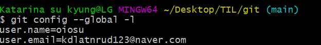
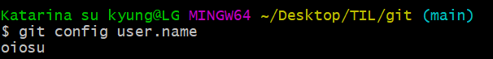
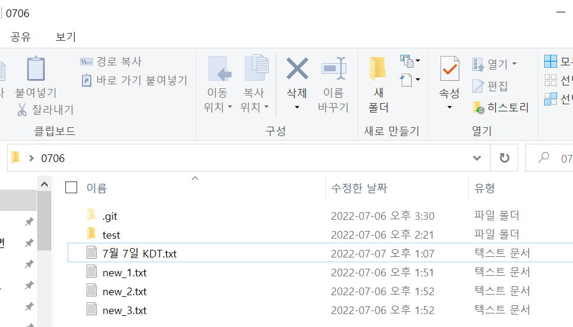
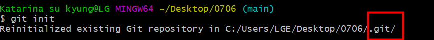

# 💁‍♀️ Git으로 저장소를 만드는 과정 


#### 📂 Section 2. 기본 설정 

*  **사용자 정보(commit author)를 먼저 설정**해 줍니다.

: 사용자 정보를 설정해주는 것은 commit을 위해 반드시 필요한 과정입니다s. 

`git config --global user.name "username"`

`git config --global user.name "my@email.com"`

(여기서 말하는 name과 email은 Github 가입시 입력한 정보입니다. )

> ``` git config --global user.name "oiosu" ```
>
>  ```gir config --global user.name "kdlatnrud123@naver.com"```


* 사용자 정보를 입력했다면, **설정 확인**을 해봅시다. 

`git config -l`

`git config --global -l`

`git config user.name`

 

> `git config --global -l` 을 입력하여 user name과 email 설정이 잘 되었음을 확인 할 수 있습니다. 



> `git config user.name` 를 통해서는 저의 github 에서 설정한 name을 확인 할 수 있습니다. 


---


#### 📂 Section 3. 특정 폴더 Git 저장소(repository) 만들기 

#### 1. 특정 폴더 생성하기

> 0706이라는 파일을 생성했습니다. 




#### 2. 특정 폴더 파일을 선택한 후 **git bash here 또는 vs code 로 열기 실행**하기 


> git bash here로 실행한 화면 


#### 3. `git init` 을 실행하여 폴더가 생성이 되었는지 확인하기



> git init을 하여 .git 폴더가 잘 생성되었음을 확인할 수 있습니다. 


---


#### ◼ [master에 대한 이슈](https://blog.outsider.ne.kr/1503) 


2020년 6월 go 언어가 인종차별적 요소나 주종 관계의 의미를 담고 있는 이슈가 있었다. 

whitelist/blacklist와 master/slave 라는 용어를 프로젝트에서 제거하기로 결정하면서 

업계의 전반적으로 master에 대한 이슈가 일어났다. 이후 master를 기본  branch로 사용하던 git에서도 이 논의가 이루어지면서 branch를 사용자가 지정할 수 있도록 [변경](https://sfconservancy.org/news/2020/jun/23/gitbranchname/)하였다. (Regarding Git and Branch Naming 참고)

이어서 github에서도 기본  branch를 master에서 main으로 변경하기로 했고 이는 10월 1일  부터 적용되었다. 

이제 저장소를 생성할 때 초기화 옵션을 선택하면 main  branch가 기본 branch로 생성됨을 알려준다. 


#### ◼ GIT의 기본  branch를 main으로 변경하는 방법

**`git checkout -b main`**


