## 😎 전체적인 협업 흐름에 대해 이해하기 

**`지난 시간 복습!!!`**

git에서 add 와 commit 명령어  => **git status** 로 확인하기 (주기적으로 입력할 것!) 

: cli 에서 활용하기 위해서는 아래의 명령어는 필수적이다. 

: 항상 모든 명령어 뒤에 상태를 확인하자. 

: git에서 local repository 는 => log

---

### 💁‍♀️ **git flow** 

>  git을 활용하여 협업하는 흐름으로 branch를 활용하는 전략을 의미한다. (가지 치기)

> 가장 대표적으로 활용되는 전략 

- master(main) : 제품으로 출시될 수 있는 브랜치_베포 가능한 상태의 코드
- develop : 다음 출시 버전을 개발하는 브랜치_feature branch로 나뉘어 지거나, 발생된 버그 수정 등 개발 진행 이후 release branch 로 갈라진다. 
- feature: 기능을 개발하는 브랜치_기능별 개발 브랜치/ 기능이 반영되거나 드랍되는 경우 브랜치 삭제 
- release : 이번 출시 버전을 준비하는 브랜치 / 개발 완료 이후 qa, test 등을 통해 얻어진 다음 배포 전 minor bug fix 등 반영
- hotfix(supporting) : 출시 버전에서 발생한 버그를 수정 하는 브랜치 / 긴급하게 반영 해야하는 bug fix / hotfix branch는 현재 버전을 위한 것

### 🔥참고자료 : 

### [우린 GIT-flow를 사용하고 있어요_우아한 형제들](https://techblog.woowahan.com/2553/)

* 검색 기능 오류가 생기면(사용자 이슈) 

  : 소스코드에 이슈대응 해주기 곧 master에 대한 코드는 사용자가 보는 화면 

* master 들어왔을 때 어?! 금지 

**✅ 브랜치 생성 : git branch {branch name}**

**✅ 브랜치 이동 : git checkout {branch name}**

**✅ 브랜치 생성 및 이동 : git checkout -b {branch name}**

**✅ 브랜치 목록 : git branch** 

**✅ 브랜치 삭제 : git branch -d {branch name}**

◼ **브랜치를 사용하는 이유 / 목적** 

: 독립적인 버전들을 나아갈 수 있도록 하기 위해서 사용한다. 

✔**branch merge** 

각 브랜치에서 작업을 한 후 이력(커밋/버전)을 합치기 위해서 **merge** 명령어 사용 

병합을 진행할 시 만약 서로 다른 (commit)에서 동일한 파일을 수정한 경우 충돌 발생할 가능성 있따. 

이 경우에는 **반드시 직접 수정을 해야하며** 충돌이 발생한 것은 오류가 발생한 것이 아닌 이력이 변경되는 과정에서 

반드시 발생할 수 있는 것이니 참고하기!!

✔**branch merge - fast -forward**

기존 master 브랜치에 변경사항이 없어 단순히 앞으로 이동 

✔ **branch merge - merge commit**

기존 master 브랜치에 변경사항이 있어 병합 커밋 발생 

​	feature-a branch 로 이동 후 commit

​	maser branch commit

​	master brach 로 병합 

**📌 github flow 기본 원칙** 

1. maser branch는 반드시 배포 가능한 상태이어야 한다. 
2. feature branch 는 각 기능의 의도를 알 수 있도록 작성한다. 
3. ⭐ commit message는 매우 중요하며, 명확하게 작성한다. 
4. pull request를 통해 협업을 진행한다. 
5. 변경사항을 반영하고 싶다면, master branch에 병합한다. 

✔ **브랜치 맛보기**

1. 개발 프로젝트 폴더 생성하기 
2. git init 저장소 설정

3. touch readme.md
4. git add readme.md
5. git commit -m 'add readme' (root-commit 확인 가능 : 첫번째)

1. git branch : 브랜치 조회 

2. git branch example  : example 이라는 브랜치 생성

3. git checkout example : 브랜치 변경 되었음을 확인 할 수 있다. 

4. git status : example.txt 작업한 내용 (빨강색 글씨)

5. git add .

6. git commit -m '예시 만들었음!'

7. git log --online

8. git checkout master 

9. git log --oneline 

   : head(현재 위치) -> master(가장 기준이 되는 뿌리) 

10.  git checkout master 

11. git merge example : 병합하는 과정 (명령어 잘 생각하기)

12. git log --online

13. git branch -d example (브랜치를 지우게 되면 커밋도 지워지는 건가요? : no / why? : 이미 합쳐졌기 때문)

14. git log --oneline

---

* 브랜치 시나리오 상황 예시

| /                 | 조장                   | 조원                  | B                                                            |
| ----------------- | ---------------------- | --------------------- | ------------------------------------------------------------ |
| 1                 | 보고서, 발표자료       | X                     |  |
| 2(서로 다른 파일) | 보고서                 | 발표자료              | 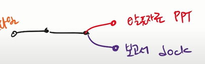 |
| 3(서로 같은 파일) | 보고서 파트1,발표파트1 | 보고서 파트2,발표파트 |  |

---

### GIT branch 

✅ 상황 (1) 혼자 작업, 조원 프리라이딩 (fast-foward)

> fast-foward 는 feture 

- feature/home 브런치 생성 및 이동

`$ git branch feature/home`

git branch

git checkout feature/home

touch home.txt

git add .

git commit -m 'conplete home!!!'

git log --oneline

✅ 상황 (2) merge commit (보고서 파일 + 발표자료 파일 : 각자 커밋이 발생했는데, 다른 파일만 수정된 경우)

* feature/about branch 생성 및 이동 

`$ git checkout -b feature/about `

* 작업 완료 후 commit 

`$ touch about.txt`

`$ git add .`

git commt -m '자기 소개 페이지 완료'

* master로 이동

git checkout master

git log --oneline

touch master.txt

git add . 

git commit -m

git log --oneline

git checkout feature/about

git log --onelin

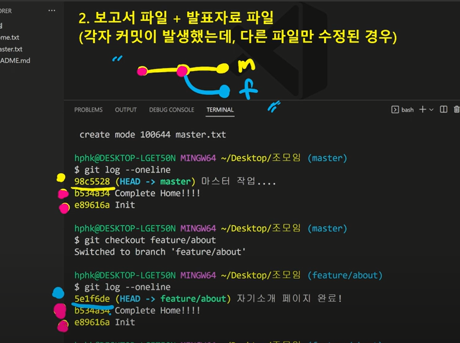

* 병합된건 무조건 지우기!

✅ 상황 (3) 혼자 작업, 조원 프리라이딩 (fast-foward)

: 진정한 협업 (각자 커밋이 있는데 파일이 수정됨 )

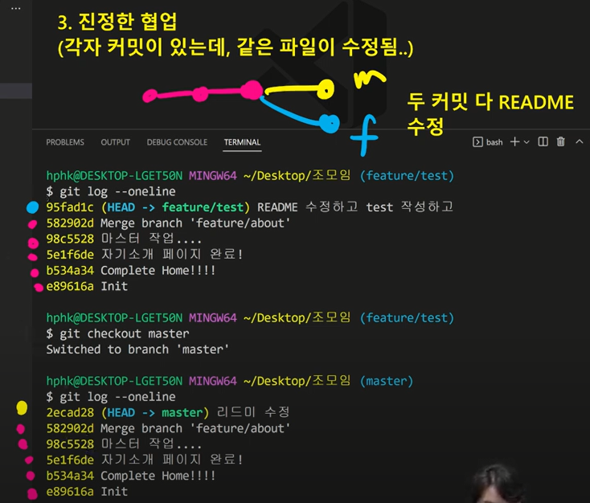

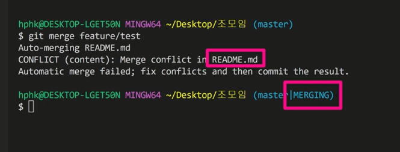

작업의 상태를 알려줘 : git status

🤔**브랜치 병합과정에서 충돌난 학생들이 충돌되었다고 달려온다. 여러분은 어떻게 이야기해줄건가요?**

=  여러분이 개발하는 방향에 맞게 고치세요 뭐하고 싶으세요?

그리고 조모임 하다가 조원이 피피티 다르다고 그냥 들고 왔어요 

교수님은 뭐라고 하실까요? 

= 피피티 만들어 와야지 뭐하는 거야?

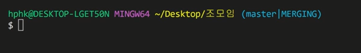

git status

* merge commit 진행

git add .

git commit (머징이 사라짐)

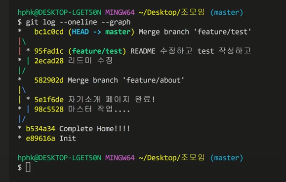

---

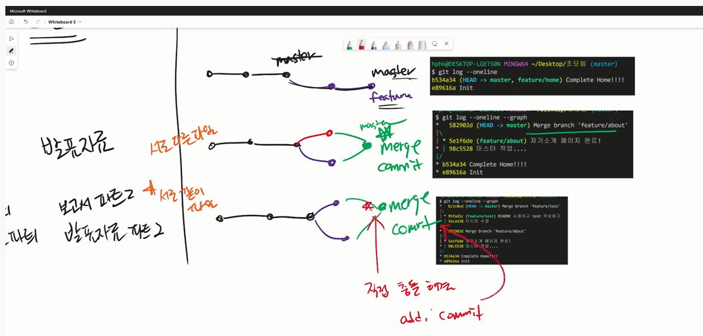

하면서 적응해나가기

---

**(중요) commit message 원칙적으로 작성하는 것 중요** 

* 저장소의 소유권이 있는 경우 **shared repoisitory model**
* 저장소의 소유권이 없는 경우 **forkoing workflow**

git checkout -b hotfix

git add .

git commit -m 'readme hotfix'

git push origin hotfix

github 에서 새로고침

(github안에서 브랜치 추가 후 master에게 데꼬가 과정까지 = 뱃지추가 하는 과정 생각해보기)

🛠 **포크** 

create a new fork

git clone 

git add . 

git commit -m '상어가족'

git push origin main (여기서 origin은 kdt-live)

---

Q. git add . 

git status 했는데 

이미지 파일을 커밋하고 f.exe 따로 커밋하고 싶었는데 

add . 해버림 어떻게 하면 f.exe 만취소 할 수 있을까요?

A. 

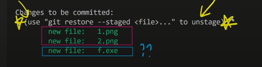

git restore --staged f.exe

git status (취소된것 확인 가능)

* ctrl+z 

* status 

* git status 

=> git restore a.txt

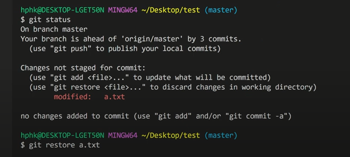

: 이후 되돌릴 수 없음 

* 커밋이 왜 중요한지 고민해보기

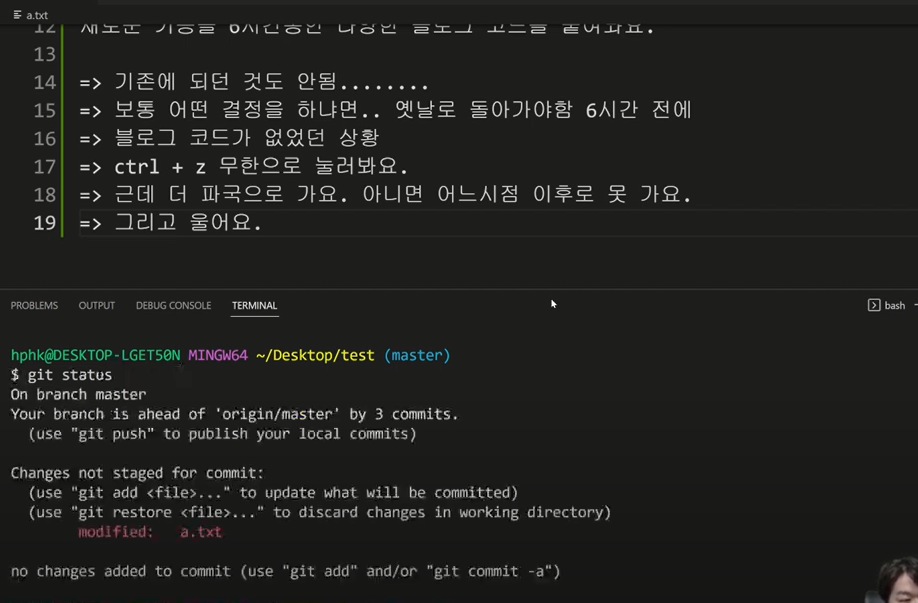

=> git restore

---

### ⭐ 메세지 잘읽자

---

* **오늘 배운 내용 최종 정리**

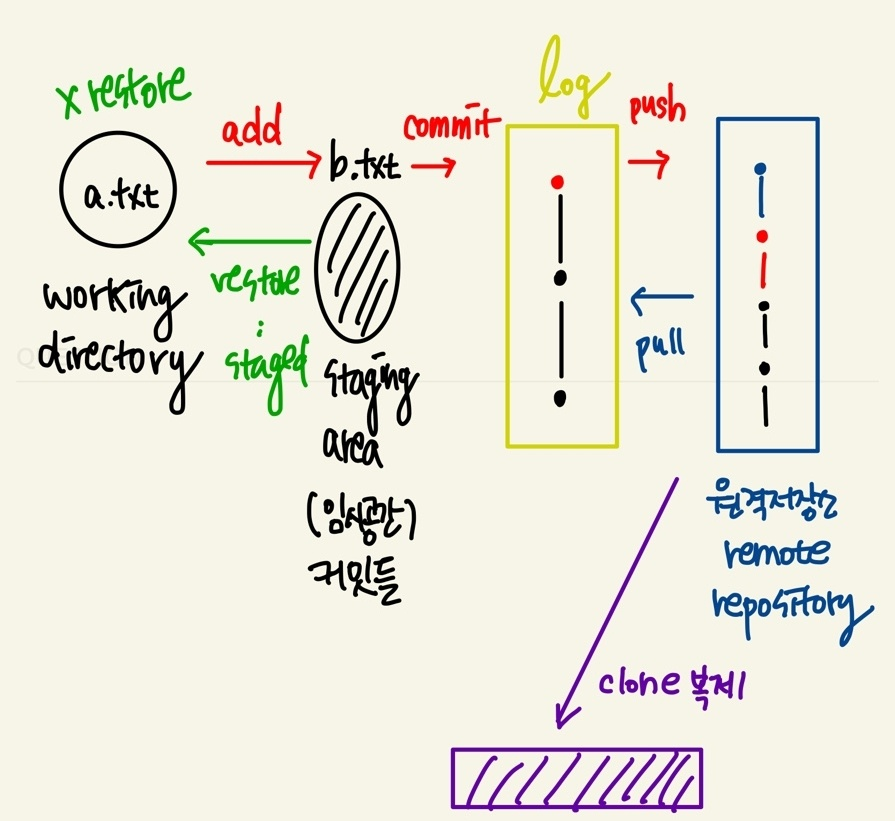

---

🔻 **주의사항** 

1. 모든 변경사항은 로컬에서 하고 commit하고 push하는 습관 지키기 

2. .gitignore 어렵게 생각하지말기

