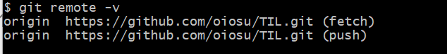
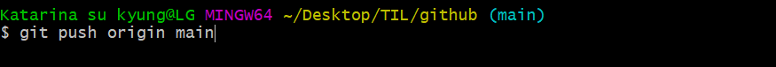
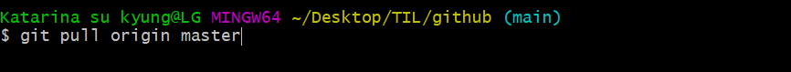
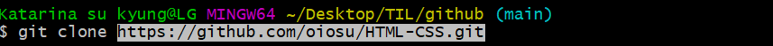

#### 📂 Section 3. 원격저장소 활용하기 

> 1. origin : 원격저장소 이름 (origin) 과 url를 확인할 수 있다. 

> 2. git **push** [원격저장소 이름]  [브랜치이름]
>
> : 원격 저장소로 로컬 저아소 변경 사항(commit)을 올림(push)

---

---

* **push 주의 사항** 
  * push 인증 정보 필수적 (push가 authentication failed 되는 경우 인증 정보 확인)

---

---

> 3. git pull[원격저장소 이름]  [브랜치이름] (master 오타 주의)
>
> : 원격 저장소로부터 변경된 내역을 받아와서 이력을 병합한다. 

> 4. git clone [원격저장소 이름] 
>
> : 원격 저장소를 복제하여 모든 버전을 가져온다. 

---

---

#### 📑 clone 과 pull의 차이점 

* `clone` 원격 저장소 복제 

* `pull` 원격 저장소 커밋 가져오기 

---

---

* **만약 저장소의 이름을 변경하고 싶다면?** 

`settings > general > repository name`

> 저장소 이름 변경 시 원격 저장소 url이 변경되어 로컬 설정 변경이 필수적이므로 주의하기 

* **저장소 public/private 전환 및 삭제** 

`settings > general > danger zone`

* **저장소 접근 관리** 

`settings > collaborators`

> 저장소에 push 권한은 collaborator 에만 있습니다. 

---

---

#### 📑 push 오류 발생 

👉**로컬과 원격 저장소의 commit 이력이 다른 경우 다음과 같은 오류가 발생한다.** 

* **해결 방법** 
  * **원격저장소의 커밋을 원격 저장소로 가져오기** ( pull)
  * 로컬에서 두 커밋을 병합하기 (추가 커밋이 발생)
    * **동시에 같은 파일이 수정된 경우 merge conflict 가 발생하나 이부분은 브랜치 학습** 
  * **다시 github으로 push 해주기** 

